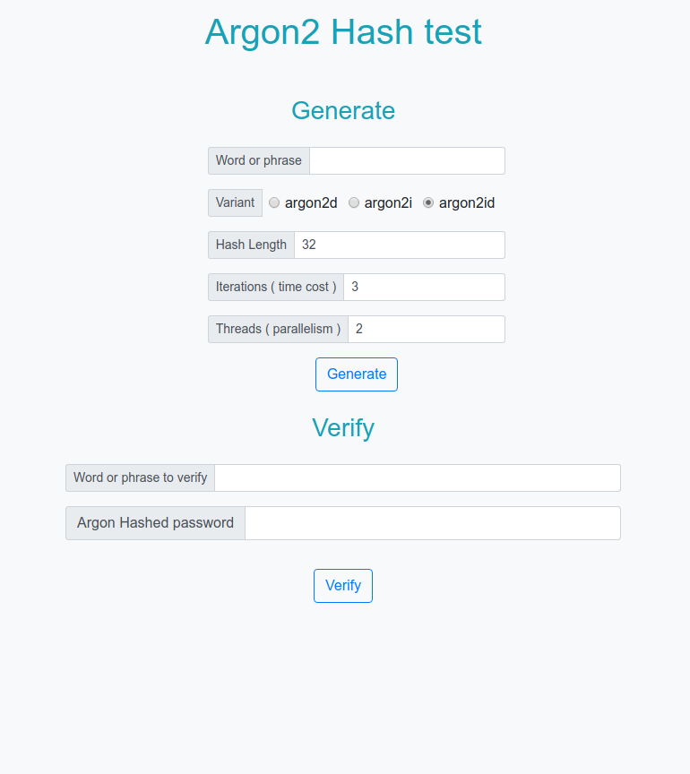
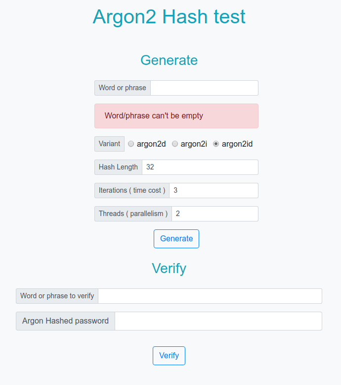
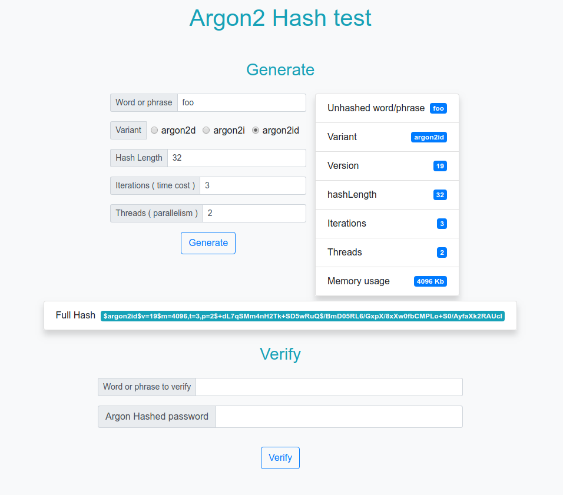
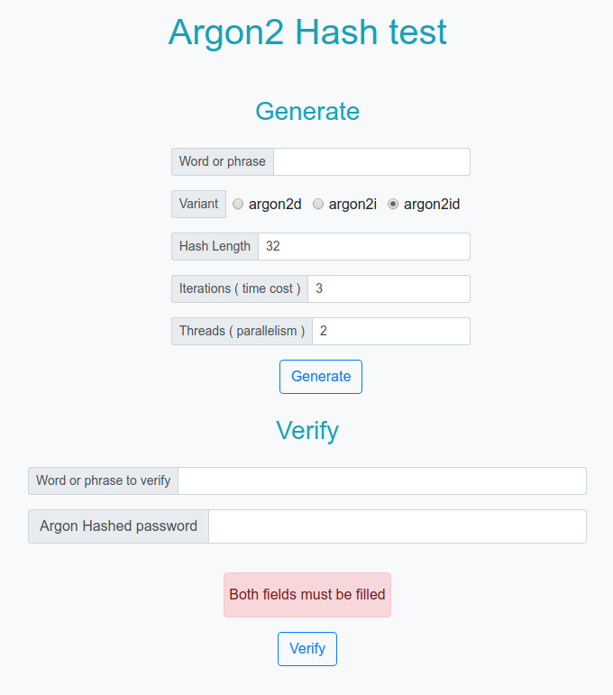
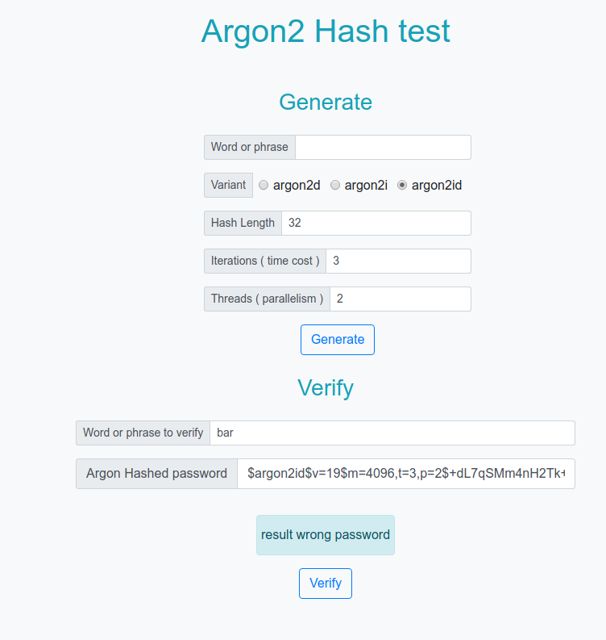
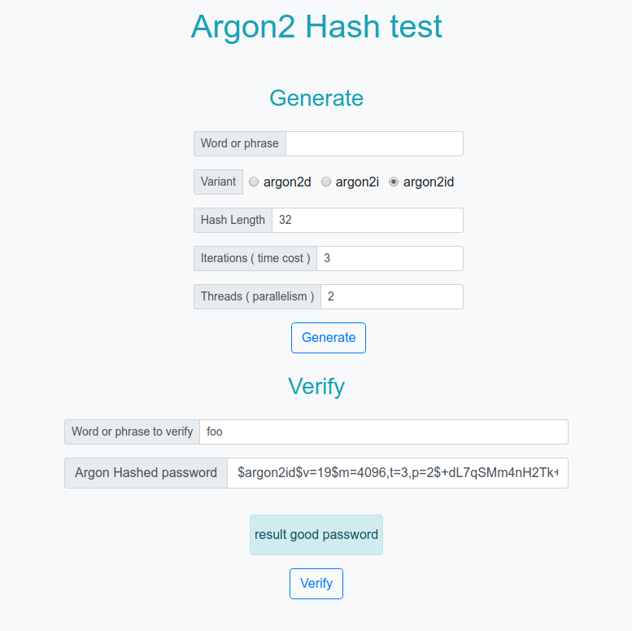
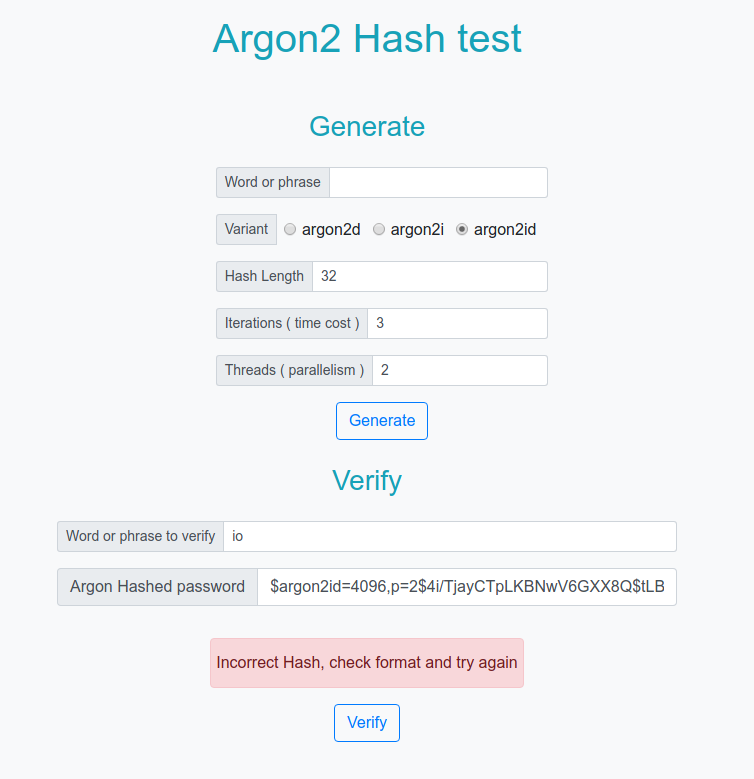

# Argon2 node test

A basic argon2 (with variants) hash generator / verify test UI interface using node-argon2 binding.

## *About Argon2*

Argon2 hashing algorithm was designed by `Alex Biryukov`, `Danie Dinu`, and `Dmitry Khovratovich` from the University of Luxembourg.

General info about argon2 in [wikipedia](https://en.wikipedia.org/wiki/Argon2)

Most detailed info [specification](https://password-hashing.net/argon2-specs.pdf)

# Technologies used in demo
- `nodejs` as server environment
- `pug` as template render engine
- `bootstrap` as CSS styling

## Screenshots

